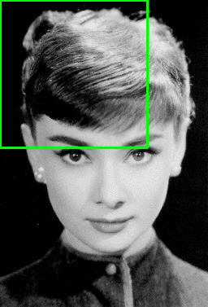

# Pedestrian Detection Demo

- [Pedestrian Detection Demo](#pedestrian-detection-demo)
  - [Description](#description)
  - [Contributors](#contributors)
  - [How to run](#how-to-run)
  - [Helpful Notes](#helpful-notes)
## Description
Created as a part of Computer Vision report on Human Detection.

A demo for `Pedestrian Detection` using `OpenCV` and `Python`. 
This demo is implemented using `Histograms of Oriented Gradients (HOG)` that is supported in the OpenCV module. It is also important to note that this also uses Sliding Window Concept to scan the video frame for multiple people.




## Contributors

- Jett Adriel Rabe
- Kent Joash Zamudio [(@github/joashdev)](https://github.com/joashdev)

## How to run
```sh
# clone repository
git clone git@github.com:joashdev/human-detection-demo.git

# goto the directory of cloned repository
cd human-detection-demo

# run using python3
python3 detect.py
```
>  **NOTE:**
>  
> This demo uses `opencv`, `imutils`, and `numpy` modules,
> you can install it using the command:
>  
> `pip3 install opencv-python imutils numpy`

## Helpful Notes
To understand pedestrian detection better, manipulate the following values:

1. `winStride`
   - (x,y) size of window used in the sliding window concept
   - bigger window means faster scanning but it has less accuracy
   - smaller window means slower scanning but it may have higher accuracy 
2. `padding`
   - `HOG for Human Detection` by Dalal and Triggs shows that there is an increase in accuracy in detection when padding is applied
   - (x,y) direction in which the sliding window is padded
3. `scale`
   
    
   - the multiscale representation of an image is best represented in the form of image pyramid.
   - at each layer of the image pyramid the image is downsized and (optionally) smoothed via a Gaussian filter.
   - smaller scale means more layers and more processing time
   - bigger scale means less layers and less processing time

The combination of these three values equates to speed:accuracy ratio. Tweak these values depending on your test file to achieve better results.